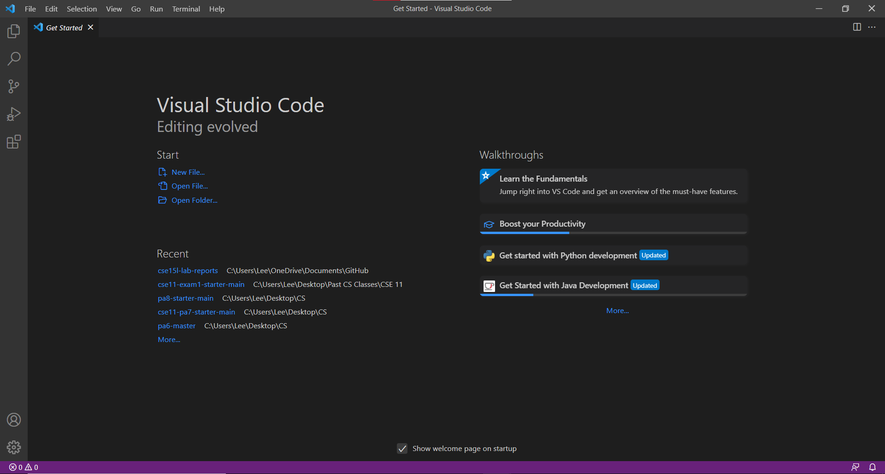
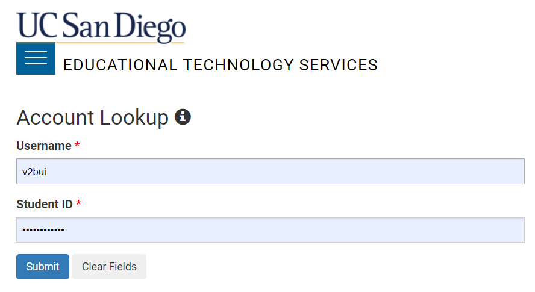
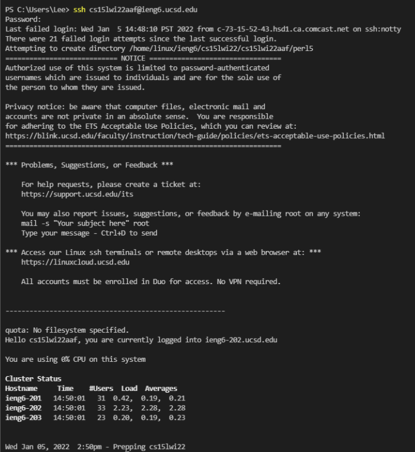
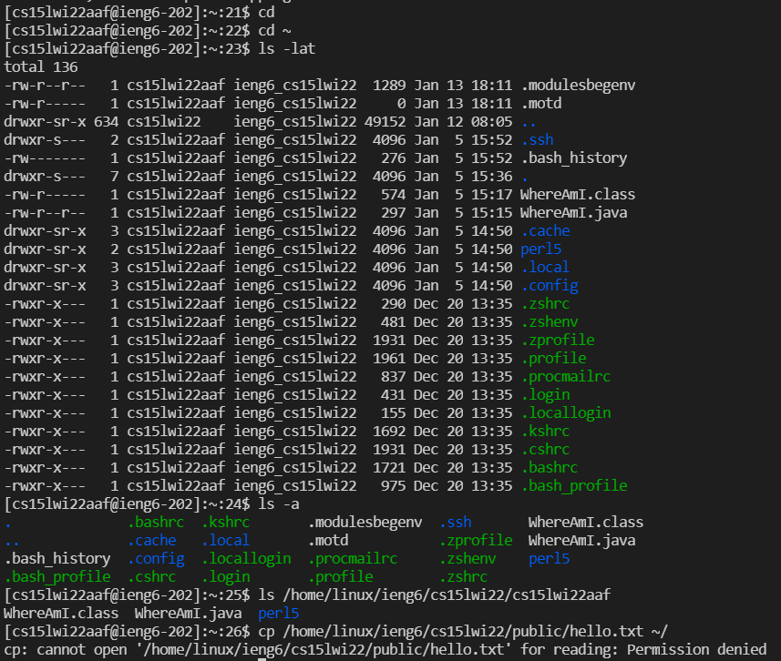
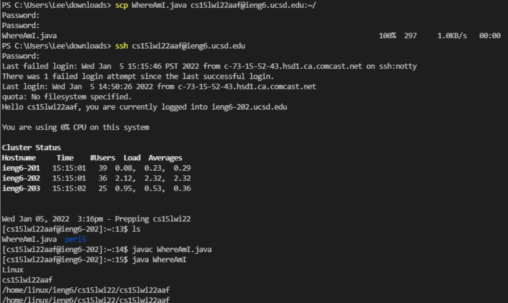
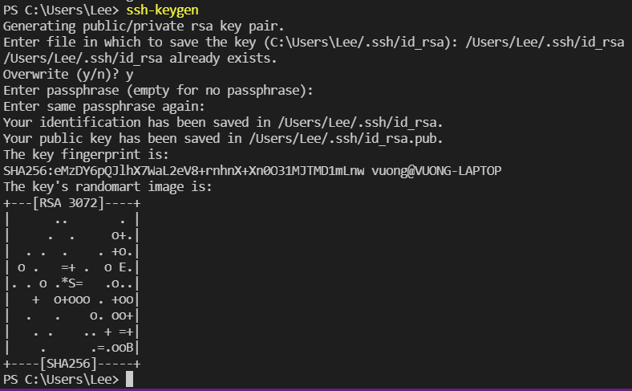
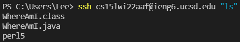
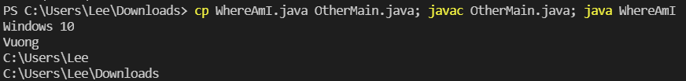

# <center> HOW TO LOG INTO A COURSE-SPECIFIC ACCOUNT ON ieng6 - Week 2 Lab Report </center>
## <center> Vuong Bui </center>
## 1. Installing VScode
* Go to https://code.visualstudio.com/ 
* Download VSCode for your specific operating system
* When installed and opened, it should look something like this: 

---
## 2. Remotely Connecting
* If you are on Windows, first install OpenSSH [here](https://docs.microsoft.com/en-us/windows-server/administration/openssh/openssh_install_firstuse)
* Look up your course-specific account for CSE15L [here](https://sdacs.ucsd.edu/~icc/index.php). The login page looks like this:

* At the top of the screen in VSCode, click Terminal and then New Terminal
* Type in this command but with abc replaced by the letters in your course-specific account\
``
$ ssh cs15lwi22abc@ieng6.ucsd.edu
``
* When it asks, type in your password. You may have to reset your UCSD password in order to log in.
* Your screen should look something like this when you first log in: 

---
## 3. Trying Some Commands
* Now that you're logged in, you can run commands on the remote computer such as:\
`cd`\
`cd ~`\
`ls -lat`\
`ls -a`\
`ls <directory>` where `directory` is `/home/linux/ieng6/cs15lwi22/cs15lwi22abc` where abc is another person's username\
`cp /home/linux/ieng6/cs15lwi22/public/hello.txt ~/`\
`cat /home/linux/ieng6/cs15lwi22/public/hello.txt`
* Try these commands on your own computer as well as the remote computer. Log out by running the command `exit` or pressing Ctrl-D.
* Commands run on the remote computer may look like this:

---
## 4. Moving Files with `scp`
* To copy a file from your computer to a remote computer, you use the command `scp` - make sure to be logged out of ieng6!
* Create a new java file and run it with `javac` and then `java`
* Afterwards, in the terminal from the directory where the file was made, run this command (with abc replaced): `scp WhereAmI.java cs15lwi22abc@ieng6.ucsd.edu:~/  `
* Put in your password like logging into `ssh`
* Log into ieng6 with `ssh`, run the command `ls`, and you should see the file in your home directory
* After doing this step, your terminal should look like this: 

---
## 5. Setting an SSH Key
* To remove the process of typing in our password every time we log in to `scp`, we can use `ssh` keys 
* To set this up, we need to create two new files on your system: the private key (id_rsa) and public key (id_rsa.pub), stored in the .ssh directory. Run this on your computer to do so:

* To copy the public key to the `.ssh` directory of your user account on the server, run this on your computer (using your own username and path in the `scp` command). If done correctly, you should be able to log into `ssh` without a password!

```
$ ssh cs15lwi22abc@ieng6.ucsd.edu
'<Enter Password>'
'# now on server'
$ mkdir .ssh
$ <logout>
'# back on client'
$ scp /Users/Lee/.ssh/id_rsa.pub cs15lwi22@ieng6.ucsd.edu:~/.ssh/authorized_keys
```
---
## 6. Optimizing Remote Running
* Now that we can log into `ssh` without a password, we can easily run commands directly on the remote server
* Putting a command in quotes at the end of an `ssh` command will do so. Try this:
`$ ssh cs15lwi22@ieng6.ucsd.edu "ls"`\
It should look something like this:\

* Use semicolons to run multiple commands on the same line. Try this: `$ cp WhereAmI.java OtherMain.java; javac OtherMain.java; java WhereAmI`\
It should look something like this:

---