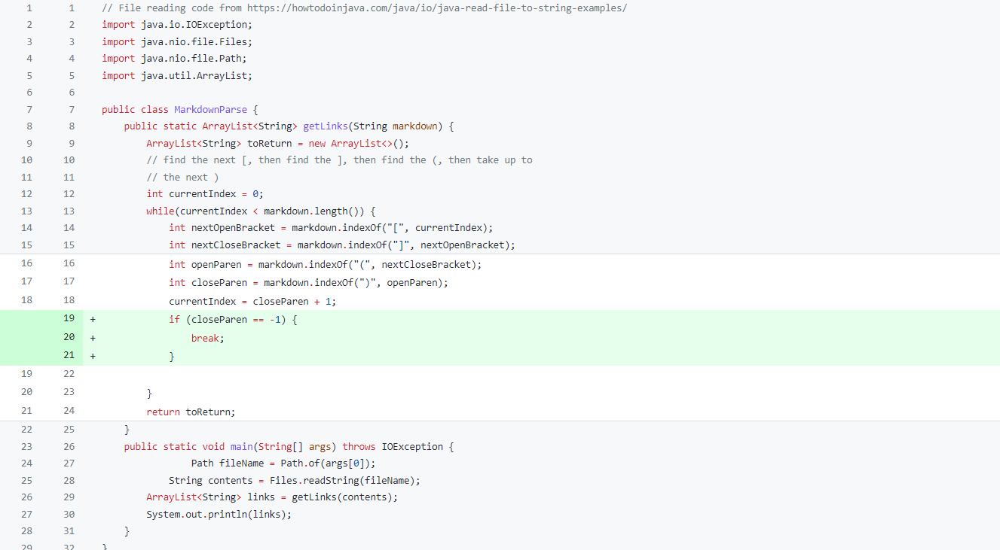
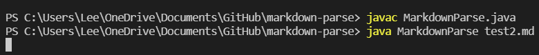
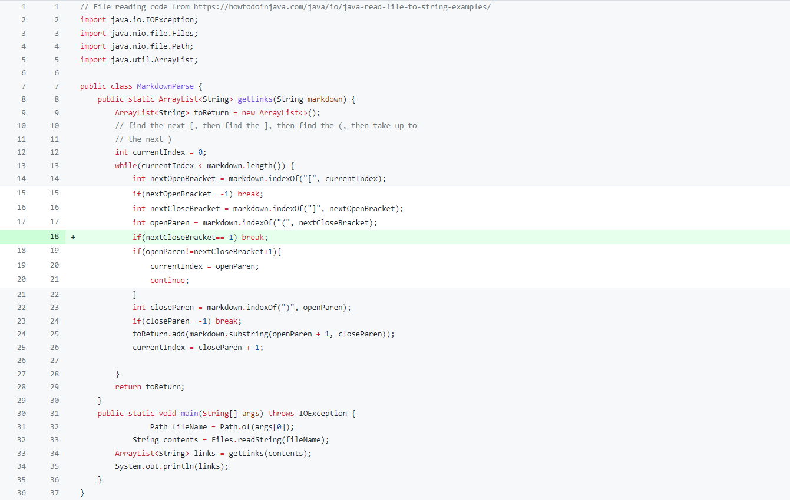
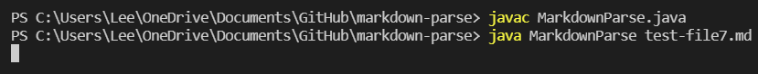
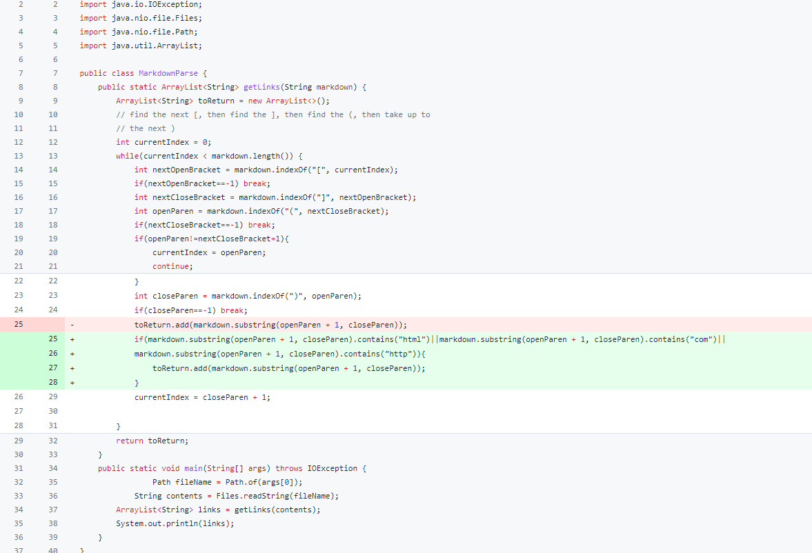
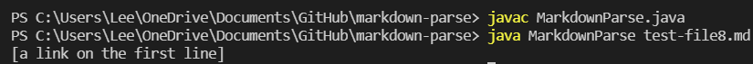

# 
 Week 4 Lab Report 2 

## 
 Vuong Bui 

## Code Change #1
* Code Change Diff:

* Failed Test File [Link](https://github.com/v2bui/markdown-parse/blob/main/test2.md)
* Symptom of the Failed Test File:

* In this case, the bug is that in the code, the variable currentIndex only gets updated if there is a closed parenthesis in the file. Because there is no closed parenthesis in this test file, the symptoms are that the currentIndex never increases and the while loop continues infinitely. 

## Code Change #2
* Code Change Diff:

* Failed Test File [Link](https://github.com/ucsd-cse15l-w22/markdown-parse/blob/main/test-file7.md)
* Symptom of the Failed Test File:

* The bug here is that our code continually searches for the next closed bracket without accounting for the fact that there may be no closed bracket. As seen in the failed test file, there is only an open bracket. This leads to the symptom of an infinite loop in which nothing is returned. 

## Code Change #3
* Code Change Diff:

* Failed Test File [Link](https://github.com/ucsd-cse15l-w22/markdown-parse/blob/main/test-file8.md)
* Symptom of the Failed Test File:

* For this situation, the bug is that the code doesn't detect whether the text within the parentheses is a link. This leads to the symptom that any text in the parentheses is returned such as [a link on the first line] in the failed test file, which is incorrect.