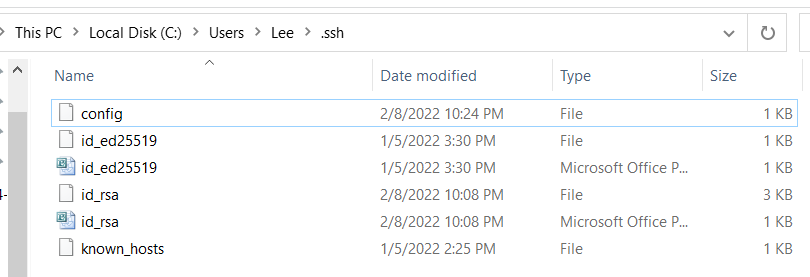
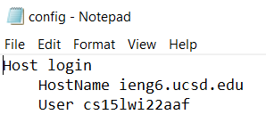
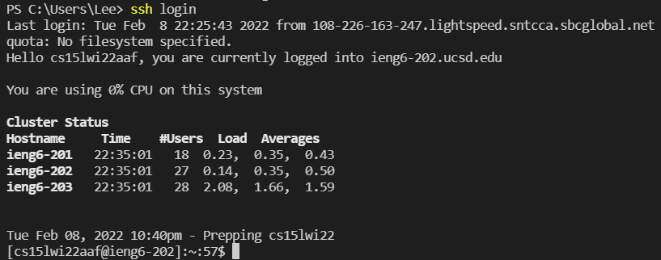
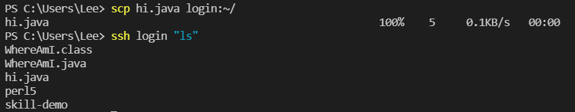

# 
 Week 6 Lab Report 3 

## 
 Vuong Bui 

## Streamlining ssh Configuration
1. **`.ssh/config` file and how it was edited:**

* Here, I created a file called config using Notepad and saved it to my .ssh folder.

* This is how I edited the file on Notepad and changed the alias to "login"
2. **Logging in using the `ssh` command with my alias**

* Here, a username is no longer required to log into ieng6.
3. **Copying a file to my account using the `scp` command with my alias**

* In this image, I successfully added a file called hi.java. With `ls`, I can see the file in my account.