# 
 Week 8 Lab Report 4 

## 
 Vuong Bui 

[My Markdown-Parse Repository](https://github.com/v2bui/markdown-parse)
[Reviewed Markdown-Parse Repository](https://github.com/AnniePhan02/CSE15L-Panther)
## Snippet #1 - My Implementation
* What should be produced: 
* 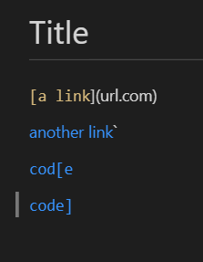
* Test Code: 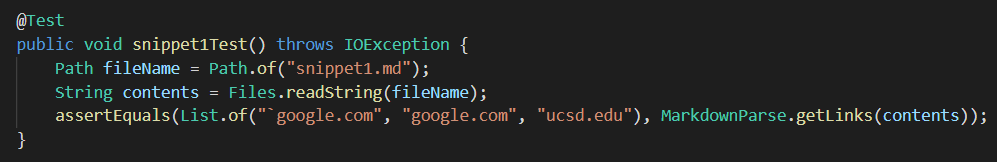
* My Implementation: 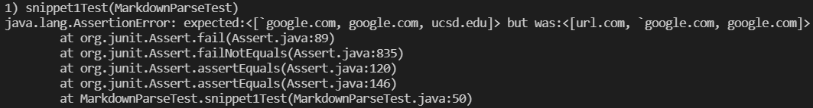

## Snippet #2 - My Implementation
* What should be produced: 
* 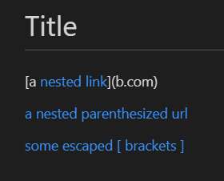
* Test Code: 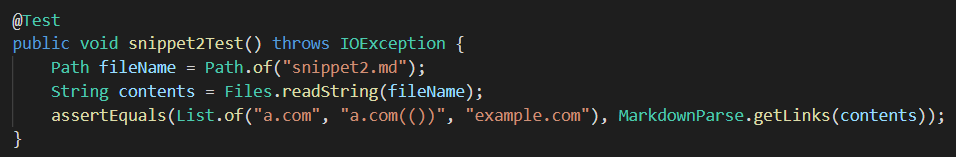
* My Implementation: 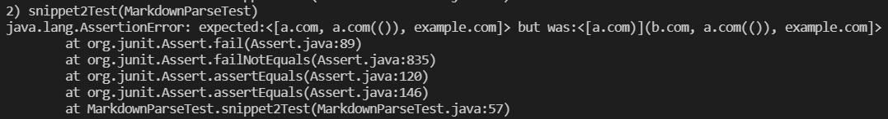

## Snippet #3 - My Implementation
* What should be produced: 
* 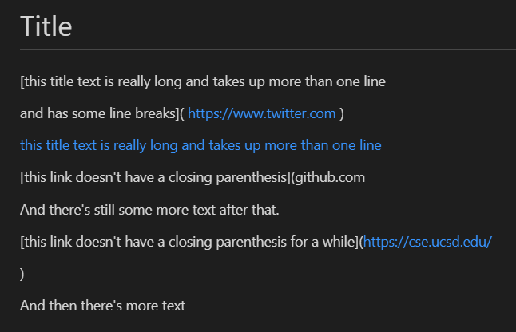
* Test Code: 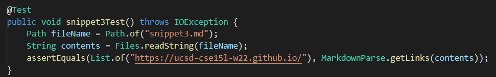
* My Implementation: 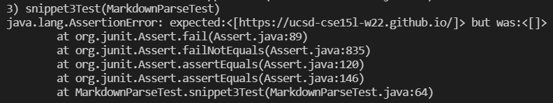

## Snippet #1 - Reviewed Implementation
* What should be produced: 
* 
* Test Code: 
* Reviewed Implementation: 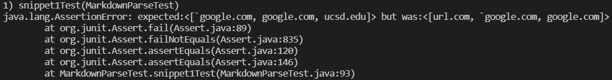

## Snippet #2 - Reviewed Implementation
* What should be produced: 
* 
* Test Code: 
* Reviewed Implementation: 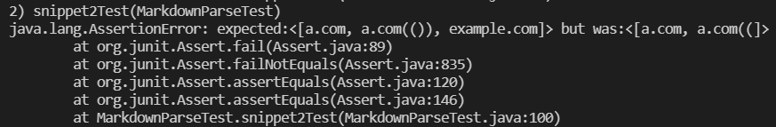

## Snippet #3 - Reviewed Implementation
* What should be produced: 
* 
* Test Code: 
* Reviewed Implementation: 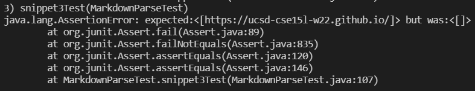

## Questions
1. Do you think there is a small (<10 lines) code change that will make your program work for snippet 1 and all related cases that use inline code with backticks?
* No, I don't think there is a small code change that will make the program work. Fixing the program will be more complex because we have to check if a pair backticks are both within a pair of brackets or parentheses or not. Additionally, checking if brackets or parentheses exist within backticks would allow us to not count them as part of link markdown formatting.
2. Do you think there is a small (<10 lines) code change that will make your program work for snippet 2 and all related cases that nest parentheses, brackets, and escaped brackets? 
* Yes, I think there is a small code change that will make the program work. Our code should search if there is another open bracket within the brackets instead of directly looking for "](" in order to locate any nested links.
3. Do you think there is a small (<10 lines) code change that will make your program work for snippet 3 and all related cases that have newlines in brackets and parentheses?
* No, I don't think there is a small code change that will make the program work. Our code currently splits the string into separate lines which doesn't allow our code to find the indices of the "](" and ")" properly if they are on a different line. It will be more complex to have to move to the next line to search for the closing brackets and parentheses.