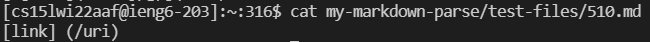
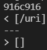
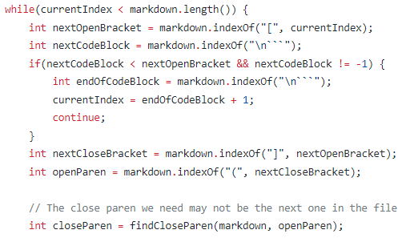

# 
 Week 10 Lab Report 5 

## 
 Vuong Bui 

## How I Found the Tests with Different Results
1. I ran `bash script.sh > sol.txt` in Joe's markdown-parse repository and copied sol.txt to the main directory.
2. I ran `bash script.sh > my.txt` in my markdown-parse repository and copied my.txt to the main directory.
3. In the main directory, I ran `diff sol.txt my.txt` to find the tests with different results.
## Test #1
* 
* 
* My implementation, `[]`, is correct because `/uri` should not be considered a link.
* 
* 