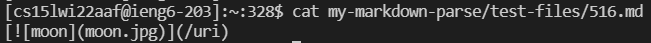
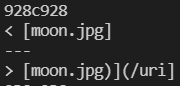
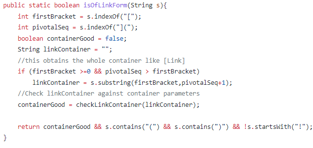

# 
 Week 10 Lab Report 5 

## 
 Vuong Bui 

## How I Found the Tests with Different Results
1. I ran `bash script.sh > sol.txt` in Joe's markdown-parse repository and copied sol.txt to the main directory.
2. I ran `bash script.sh > my.txt` in my markdown-parse repository and copied my.txt to the main directory.
3. In the main directory, I ran `diff sol.txt my.txt` to find the tests with different results.
## Test #1
* Test: 
* Result: 
* My implementation, `[]`, is correct because `/uri` should not be considered a link since there is a space between the closing bracket and open parentheses.
* 
* In this part of the getLinks method in Joe's markdown-parse, the bug in the code is that there is no check to see if openParen is one index greater than nextCloseBracket.
## Test #2
* Test: 
* Result: 
* Joe's implementation, `[moon.jpg]`, is correct because it catches the nested link within the brackets whereas my implementation does not.
* 
* In the isOfLinkForm method in my markdown-parse, the bug is that after finding the first open bracket, the code immediately looks for `](` without checking if there are any other open brackets before it.